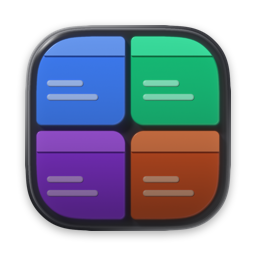

# Code Tiles

All your projects in one window.

Every tile is a real editor: your extensions, your settings, your keybindings, a working terminal.
They are all windows onto **one shared code-server**, so you sign in once and every project has it.

It exists for the grid. If you run a coding agent in more than one project at a time, the thing
you keep losing is which one needs you - so you cycle through windows to find out. Here they are
all on screen, and each tile says what its agent is doing without your having to open it.

Runs on macOS, Windows and Linux.

## The window

A strip across the top, and the rest is the grid. The strip holds one chip per open project, a
button to open another, a usage meter and the layout buttons - grid or one project, and the side
bar, panel and secondary side bar in every project at once. It is also the window's title bar, so
your OS draws its own window controls into it.

Tiles are laid out as near square as the count allows. Four projects make two rows of two, nine
make three of three; where a row would come up short the last tile stretches to fill it, so you
never look at a gap. Drag the space between two tiles to give one more room than the other,
double-click that space to even it up again, and the sizes stick - resize the window, close a
project and reopen it, quit and come back, and the grid is how you left it.

**Maximize**, the button under a tile's project icon, gives that project about seven tenths of the
width and stacks the rest down the side, still live, so you can work in one and watch the others.
It stays where you put it: clicking into a stacked tile moves the focus there without moving the
big one.

## Focus, and a colour per project

One project is focused at a time. Click into a tile, click its chip, or use the keyboard.

You can tell which one it is by colour rather than by a border: the focused tile's margins and the
gaps between its panels pick up that project's own hue, the space around the tile glows faintly
with it, and its chip in the strip is filled in.

Each project gets its colour from its favicon, so a project you know by its logo gets a tile that
matches, and a project without one gets a stable colour derived from its path. The same hue shows
up in a few deliberate places inside the editor - the sidebar header, the branch pill, the active
tab - which is what stops you typing into the wrong project.

Right-click a project's icon - at the top of its tile, or on its chip in the strip - to choose for
yourself. **Icon** puts an image of your own, or the project's initial letter, in place of the
favicon, and an image of your own sets the colour the way a favicon does. **Color** picks one of
eight hues. **Automatic**, in either, goes back to what the app worked out.

**Preferences** has three options. **Project colour** is how strong that colour is, on a dial for
the tile you are in and another for the ones you are not; turn them both down and the tiles stay
apart by their icons and names alone. **Corners** is smooth, the squircle macOS draws its own
windows with, or round. **Sound** is the buzz described below, on or off.

## What your agent is doing

Every tile shows a small ring around its project icon, and the ring's **movement** is the state:

| The ring | Means |
|---|---|
| spinning | Claude is working |
| blinking | it asked you something and is waiting |
| slowly breathing | it finished a turn you have not read yet |
| absent | nothing running |

The same ring is on the chip in the strip, so you can see a project that is not on screen, and on
the chat tab inside the editor, where you are already looking. When the whole app is behind
something else the taskbar picks it up: a count on the Dock on macOS and on a Unity launcher,
and a flashing taskbar button on Windows, which has no badge to set.

It is heard as well: a short buzz each time a session finishes a turn or asks you something, in
any tile. The speaker at the right of the strip turns it off and on, as does **Preferences**.

This reads Claude Code's own hooks, so it works whether you use the CLI or the extension.

The meter in the strip is your Claude subscription's usage: a bar for the 5-hour limit and one for
the week, each marked at how far through its window you are, so a fill past the mark is the cap
arriving before the reset. Click it for exact numbers, reset times and usage per model. Until you
connect it reads **Connect Claude**, and the click signs you in.

## Opening and closing projects

The **+** button in the strip opens a search field over one list: the projects you have opened
before, then folders on disk you have not. Type to narrow it. Type a name to match a name, or
include a slash to match the path - `work/api` will find `~/work/acme/api` when no single name
would. Start with a path and it browses instead, so `~/code/` lists what is in it and each `/`
goes a level deeper.

Arrow keys move the selection, Return opens it, and the right arrow steps into a folder without
opening it. Opening a project that is already open just focuses its tile.

With no project open, the window offers up to eight of the projects you have opened before, four
to a row. Click to tick the ones you want and the button under them opens them all; double-click
one to open just that one. With nothing ticked the button is **Open Project**, the same search
field, which is how you reach a folder the app has never opened.

Close a project with the **×** in its top right corner, the **×** on its chip, or the keyboard.
Closing keeps it in the list, so reopening is one click; a folder you have deleted since drops off
the list on its own.

You can also point a tile somewhere else from inside it - File > Open Folder, or a row of the
welcome page's Recent list. The tile stays where it is in the grid and becomes that project.

**Rearranging** works one way per view. In the strip, drag a chip along the row and it slots in
where you drop it. In the grid, drag a tile by its project icon onto another tile and the two
swap places. Escape cancels either.

## Keyboard

| | macOS | Windows and Linux |
|---|---|---|
| Focus project 1 to 9 | `⌃⌘1` … `⌃⌘9` | `Ctrl+Alt+1` … `Ctrl+Alt+9` |
| Next / previous project | ``⌘` `` / ``⇧⌘` `` | ``Ctrl+Alt+` `` / ``Ctrl+Alt+Shift+` `` |
| Grid / one project | `⌃⌘G` / `⌃⌘E` | `Ctrl+Alt+G` / `Ctrl+Alt+E` |
| Open a project | `⌘O` | `Ctrl+O` |
| Open a folder directly | `⌃⌘O` | `Ctrl+Alt+O` |
| Close the focused project | `⌃⌘W` | `Ctrl+Alt+W` |
| Even the tiles out again | `⌃⌘0` | `Ctrl+Alt+0` |
| Zoom every tile together | `⌘+` `⌘-` `⌘0` | `Ctrl+=` `Ctrl+-` `Ctrl+0` |
| Preferences | `⌘,` | `Ctrl+,` |

The app deliberately sits one modifier above the editor's own, so nothing it binds shadows a
shortcut you press inside a tile.

## Inside a tile

It is stock VS Code, with a short list of changes that only make sense in a grid:

- **No title bar or status bar.** The strip already says which project this is, and the status bar
  carries per-file detail you would not read from a tile you are glancing at.
- **The activity bar keeps four views** - files, search, source control, Claude's sessions. The others
  move into its own overflow menu rather than disappearing. A tile is narrow.
- **The window wears the project's colour**, more of it when focused, less when not.
- **The branch moved under the file tree**, since the status bar that used to carry it is gone.
  Clicking it still checks out and syncs.
- **Terminals are tabs across the top of the panel** instead of a list down its right edge, which
  costs width in every tile at once.
- **Maximize Panel and the Run button are hidden**, being two buttons a tile cannot honour. Their
  commands and keyboard shortcuts still work.

Claude Code's extension gets three fixes: a new session opens as a tab rather than in a locked
column split off to the right, a chat link to an image, sound or video opens it, and the onboarding
checklist and announcements are gone. If an extension update moves what a fix hooks into, a warning
mark in the strip names the one that stopped applying.

An image attached to a Claude chat can be marked up before it goes. Click it in the message box
and its preview has a pencil beside the ×: crop it, or draw an arrow, a box or a circle, in magenta
or one of five other colours. **Done** swaps the attachment for the marked-up copy, **Undo** or
`⌘Z` (`Ctrl+Z`) takes back a step, and Escape cancels. This one is in the tiles only:
`npm run patch-vscode` does not bring it to your desktop VS Code.

Your setup comes with you: every profile in your desktop VS Code is copied over - settings,
keybindings and extensions - and each project opens on the profile your desktop already uses for
that folder. It is a copy, and your desktop VS Code is never written to.

## Getting it running

You need Node 20 or newer for the tooling, and a code-server for the app to serve the editors
from.

```bash
npm install
npm run fetch-code-server
npm start
```

On **macOS and Linux** `fetch-code-server` downloads the pinned build into `vendor/`, and the
packaged app carries it. On **Windows** there is nothing to download - coder publishes no Windows
build - so install one yourself with `npm install -g code-server` and Code Tiles will find it on
your `PATH`, or point `CODE_TILES_CODE_SERVER` at it. That install compiles native modules, so it
needs **Python 3 and the MSVC C++ build tools** on the machine first - and on **arm64** it needs
them for `argon2` as well, which publishes no arm64 build.

| Command | Does |
|---|---|
| `npm start` | run it |
| `npm test` | the test suite |
| `npm run package` | build an app for this machine's platform |
| `npm run package:mac` / `:win` / `:linux` | build for one specific platform |
| `npm run install-app` | macOS only: package, sign, and install into `/Applications` |
| `npm run patch-vscode` | apply the Claude extension fixes to your own desktop VS Code |

Packaging for a platform other than your own works, but the code-server in `vendor/` is a native
build for the machine you fetched it on, so it is left out of a cross-built app and that app looks
on `PATH` instead.

Early days, and built for one person's daily use. `docs/` has the architecture, the constraints
worth knowing before changing anything, and what is actually built so far.
